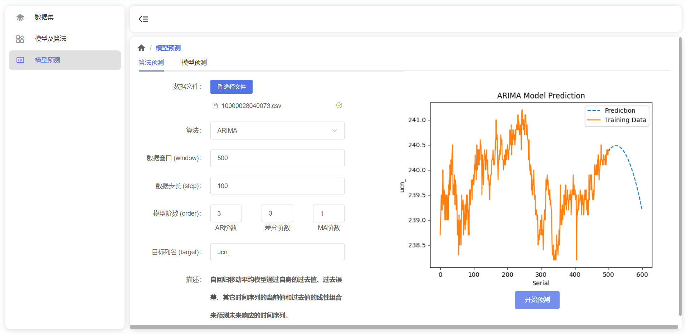

# Time Series Prediction Engine

This is the back-end part of the DataPrediction platform program.

The project

- Implemented a web platform for time series data prediction, performing data selection, processing, and training time series forecasting models to achieve predictions for future data.
- Supports uploading datasets with functionalities for data addition, deletion, and search, allows customization of training parameters such as network architecture, optimization algorithms, number of neurons, learning rate, batch size, validation set ratio, etc, and selection of specific fields for training and prediction.
- Used Django for backend development with REST API, employed WebSocket for real-time communication with the frontend to display training task progress.
- Used Celery for task queue management, coupled with Redis for progress  and channel storage.
- Used Vue.js for the frontend with Element Plus as the component library.
- Used **fbprophet**, **AR**, **ARIMA** and **neural network** for effective implementation of predictive analytics.

# Usage

1. Install package dependencies:

    You can use `anaconda` or `miniconda` to install package dependencies. Paste `environment.yml`, then use `conda create -f environment.yml`. Then activate the environment with `conda activate Django`.

    You can also use `pip install -r requirements.txt` to install these packages, or install them one by one manually when trying to start the server.

2. Run **celery** under the root directory using `celery -A DataPrediction worker --loglevel=info --pool=solo  --concurrency=1` (for Windows).

3. Run a [Redis server](https://github.com/tporadowski/redis/releases). You may need to change the address, port number and password of the redis server in `utils/db.py`.

4. **Make sure there are directories for the storage of uploaded and result files.**

    There should be `temp` `dataset` `result` `result/figure` `torch_models` under the root directory.

    ```shell
    ├─analysis
    ├─assets
    ├─DataPrediction
    ├─file
    ├─forecast
    ├─utils # name of directories are defined here at utils.storage
    │ # Make sure the following directories exist
    ├─result
    │  └─figure
    ├─temp
    ├─torch_models
    └─dataset
    ```

5. Run `python manage.py runserver`. The service will run on port 8000 by default.

6. Run the front-end server.

# Demo

## Page 1: Dataset Management

*Uploading dataset*


*Checking dataset*


## Page 2: Model Training

*Creating training model*


*Training models*


*Checking training result*


## Page 3: Data Forecasting

*Forecasting data using pre-trained models*


*Forecasting data using AR*


*Forecasting data using ARIMA*



*Forecasting data using fbprophet*

